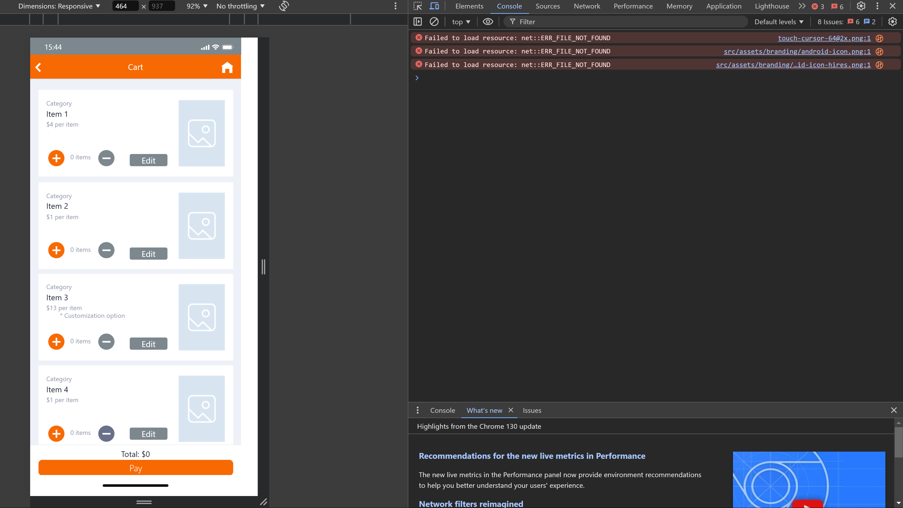
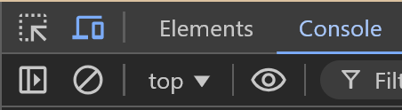
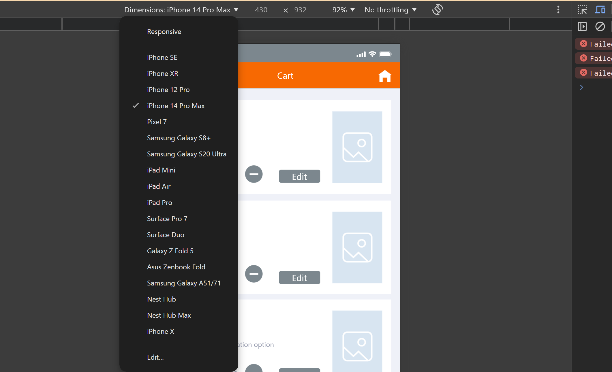

# Tiger Eats README
- Version: 1.0
- Date: 11/15

## Presented by: Team 10
- Jessica Ahls
- Darren Rodrigues
- Kenny Casey
- Angel Vasquez

## Introduction
- Our new system Tiger Eats will be replacing the previous RIT On-demand ordering system by creating a more streamlined ordering process. The system will be available to RIT students, dining faculty, and visitors. Our design vision is to make the ordering experience feel seamless and while also providing additional information and choice for the students. Our focus on a streamlined ordering process will allow users to feel less overwhelmed by inconsistent organizational choices, allowing them to also save time while ordering and leaving them with a sense of confidence and safety by alerting them of allergens and making nutrition info easier to find.

- This README includes a basic overview of our prototype for our Tiger Eats application. This document includes the following sections:
    - Installation procedure
    - Runtime environment
    - Unsupported Features
    - Bugs 
    - User Operation Instructions

## Installation procedure 
1. Download `SWEN 444.01 Team 10 Tiger Eats-html.zip`
2. Unzip the folder into your preferred directory as `SWEN 444.01 Team 10 Tiger Eats-html` and open the folder.
3. Open the `\src` directory.
4. Open the `index.html` file. The prototype should be viewable now and     left-aligned in the page.
5. To view prototype as a mobile device
    
    5.1 Open the debugging console. On windows you can use: `Ctrl+Shift+J`

    
    5.2 Open the Device Toolbar. There are multiple ways to do this:
    -  Use `Ctrl+Shift+M`
    - Alternatively, click the icon of a phone in front of a laptop which is highlighted in blue in the screenshot below. 
    
    
    5.3 Change the Dimensions to `iPhone 14 Pro Max`
    - The Dimensions dropdown is located on the top right of the 
    
6. Continue to `User Operation Instructions` to view the app.

## Runtime Environment
1. This application is a prototype created using Proto.io
2. Compatible with modern mobile browsers
3. If being used on a desktop, set the screen to a mobile device

## Unsupported Features
N/A

## Bugs 
N/A
- Make sure it opens on homepage.

## User Operation Instructions

### 1. Getting Started
- Launch TigerEats app
- From the homepage, you can access:
  - View Stores
  - View Map
  - Calorie Tracker
  - Order History
  - View Profile

### 2. Finding Restaurants
#### Using Store List
- Click "View Stores" to see all available locations
- Each store displays:
  - Operating hours
  - Star icon for favoriting
  - Current status
- Filter stores by favorites using the star icon

#### Using Map View
- Click "View Map" for location-based search
- Use category filters at the top:
  - Restaurants (8)
  - Cafes (6)
  - Pizza (5)
  - Ice Cream (3)
- Click on a location to see:
  - Restaurant name
  - Location details
  - "Favorite," "Reviews," and "View" options
- Use search bar for specific locations

### 3. Ordering Food
1. Select a restaurant
2. Browse menu items using category filters:
   - Sandwiches
   - Pizza
   - Wraps
   - Drinks
   - Dessert
3. Click on items to view details:
   - Check prices
   - Review customization options
   - View allergy warnings
   - Access nutrition information
4. Select "Add to Cart"
5. Adjust quantities as needed

### 4. Managing Your Cart
- Access cart via the icon in top right
- For each item:
  - Use + and - buttons to adjust quantity
  - Click "Edit" to modify options
  - Remove items using the minus button
- Review total at bottom
- Click "Pay" to complete order

### 5. Tracking Calories
- Access via "Calorie Tracker"
- View daily progress circle
- Check nutritional breakdown:
  - Protein percentage
  - Carbs percentage
  - Fats percentage
- Access "Meal History" to view detailed intake
- Review past meals with calorie counts

### 6. Managing Order History
- View complete order history with:
  - Restaurant name
  - Date and total amount
  - Item list
  - Number of items
- Use "Reorder" button for repeat orders
- Access receipts via "Receipt" button

### 7. Profile Management
#### Updating Profile Information
- Access Settings
- Edit:
  - Username
  - First name
  - Last name
  - Email

#### Managing Account Settings
- Change password
- Add/remove allergens:
  - Click "Add Allergen"
  - Remove existing allergens using 'X'

### 8. Safety Features
- Check allergy warnings on items
- Review nutrition information
- Maintain updated allergen list in profile
